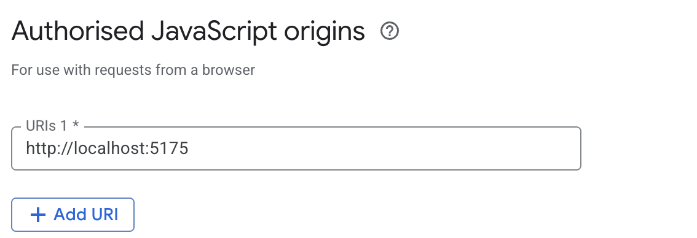
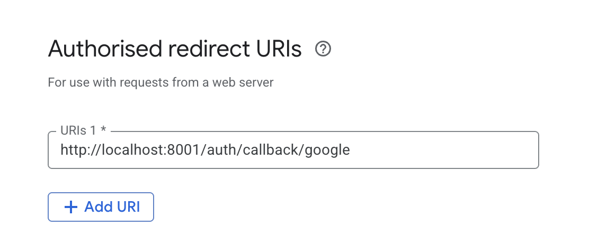
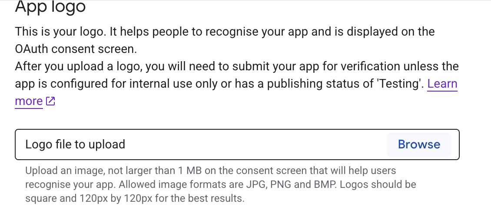
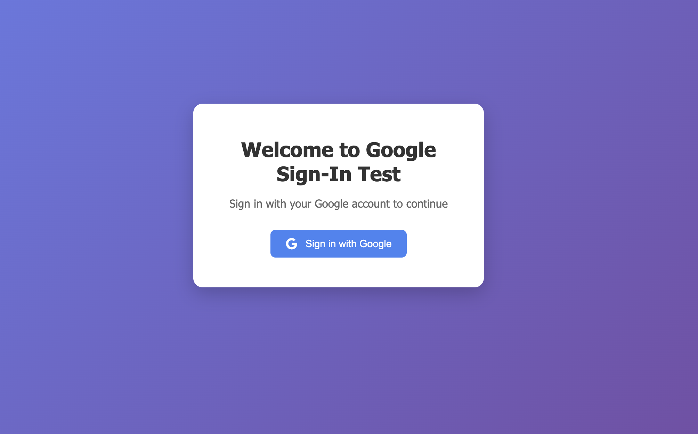
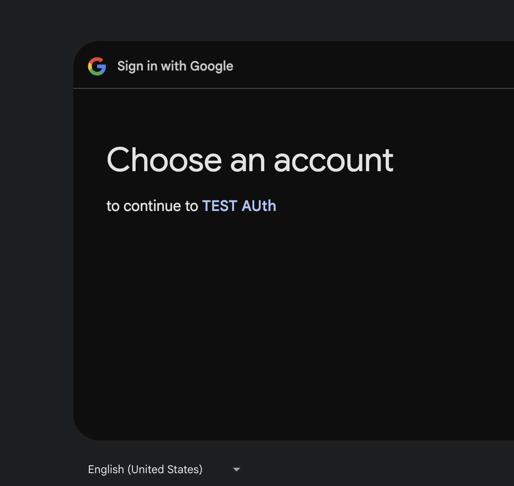

# Google Sign-In Test App

A simple application to test Google Sign-In functionality with FastAPI backend and HTML frontend.

## Features

- Google OAuth 2.0 authentication
- FastAPI backend with token verification
- Modern HTML frontend with Google Sign-In button
- Welcome page displaying user email after successful authentication
- CORS enabled for cross-origin requests

## Setup Instructions

### 1. Google OAuth Setup

1. Go to the [Google Cloud Console](https://console.cloud.google.com/)
2. Create a new project or select an existing one
3. Enable the Google+ API
4. Go to "Credentials" and create a new OAuth 2.0 Client ID
5. Set the **Authorized JavaScript origins** to:
   - `http://localhost:5175`
   - `http://127.0.0.1:5175`
6. Set the **Authorized redirect URIs** to:
   - `http://localhost:8000/auth/callback/google`
7. Copy your Client ID and Client Secret

### 2. Backend Setup

1. Install Python dependencies:
   ```bash
   pip install -r requirements.txt
   ```

2. Set environment variables with your Google OAuth credentials:
   ```bash
   export GOOGLE_CLIENT_ID="your-google-client-id"
   export GOOGLE_CLIENT_SECRET="your-google-client-secret"
   ```

4. Start the backend server:
   ```bash
   cd backend
   python main.py
   ```
   The backend will run on `http://localhost:8000`

### 3. Frontend Setup

1. Start the frontend server:
   ```bash
   cd frontend
   python server.py
   ```
   The frontend will run on `http://localhost:5175`

### 4. Usage

1. Open your browser and go to `http://localhost:5175`
2. Click the "Sign in with Google" button
3. Complete the Google authentication flow
4. You'll be redirected to a welcome page showing "Welcome [your-email]"
5. Click "Logout" to sign out and return to the sign-in page

## Project Structure

```
├── backend/
│   └── main.py              # FastAPI backend with Google OAuth
├── frontend/
│   ├── index.html           # HTML frontend with Google Sign-In
│   └── server.py            # Simple HTTP server for frontend
├── requirements.txt         # Python dependencies
└── README.md               # This file
```

## API Endpoints

- `GET /` - Root endpoint
- `GET /auth/google` - Initiate Google OAuth flow
- `GET /auth/callback/google` - Handle Google OAuth callback
- `GET /api/user` - Get user information (requires Bearer token)
- `POST /api/verify-token` - Verify Google token and return user info

## Troubleshooting

1. **CORS errors**: Make sure both servers are running and the frontend is accessing the correct backend URL
2. **Google Sign-In not working**: Verify your Google Client ID and Client Secret are correctly set as environment variables
3. **Token verification fails**: Check that your Google OAuth credentials are properly configured
4. **Redirect URI mismatch**: Ensure the redirect URI in Google Console matches `http://localhost:8000/auth/callback/google`

## Security Notes

- This is a test application and should not be used in production without proper security measures
- This implementation uses the authorization code flow for better security
- The Client Secret is used securely on the backend to exchange authorization codes for tokens
- State parameter is used to prevent CSRF attacks
- In production, consider using secure session management and HTTPS




Leave empty:




